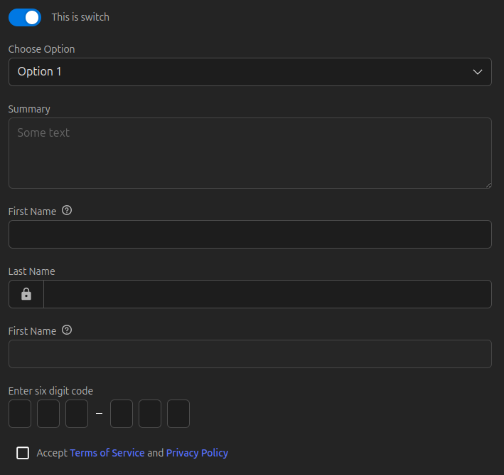

# react-form-controls

A set of html form elements for react, with support for react-hook-form.

## Features

- Simple integration
- Supports [react-hook-form](https://react-hook-form.com/)
- Elastic textarea
- Display validation error
- Simple styling width css variables
- Light 22kb (5.2kb compressed)



## Installation

```shell
npm install @itsib/react-form-controls
```

If necessary, connect the stylesheet in your index.tsx root file:

```typescript jsx
import '@itsib/react-form-controls/css'
```

Or if you use post css with the postcss-import plugin:

```css
@import url("@itsib/react-form-controls/css");
```

## Usage

All the props are passed to the input inside the component, and the internal input is tipped out through the ref. So any component can be used as a regular form element.

```typescript jsx
<FormControlInput
    id="text-input"
    label="first_name"
    hint="first_name_hint"
    error={errors?.text}
    value={vaue}
    onChange={event => setValue(event.target.value)}
/>
```

There is a demo project in the demo [folder](./demo), where there are examples of using all form elements.